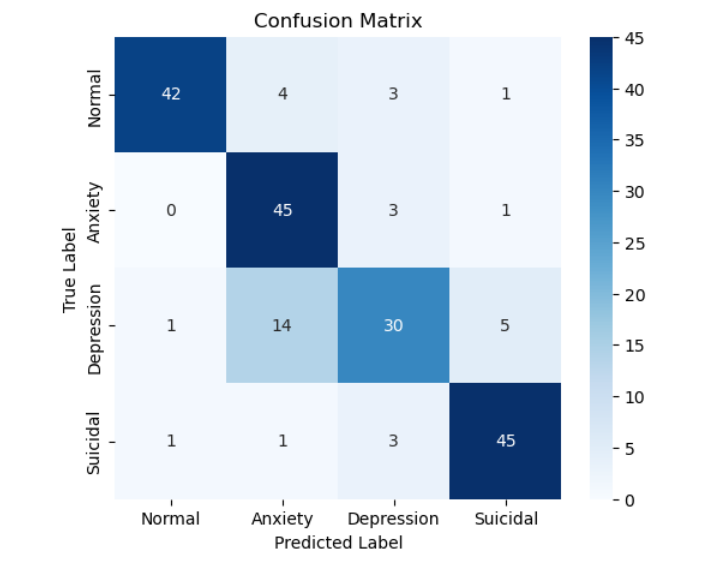
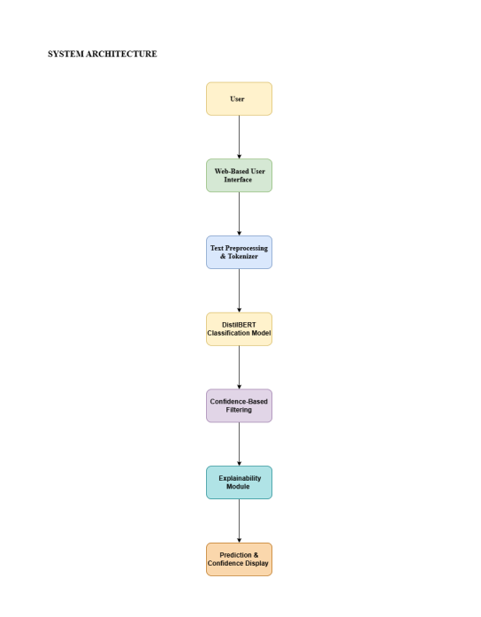

# AI-Based Mental Health Stress Monitoring System

An AI-powered mental health stress monitoring and early warning system using NLP and DistilBERT-based text classification.

## Features
- NLP-based mental health classification
- DistilBERT transformer model
- Confidence-based filtering
- Explainability module
- Real-time prediction interface using Streamlit

## Tech Stack
- Python
- DistilBERT
- Hugging Face Transformers
- PyTorch
- Streamlit

## Model Categories
- Normal
- Anxiety
- Depression
- Suicidal

## Results
- Achieved approximately 81% classification accuracy
- Implemented confidence-based ethical prediction filtering

## Future Enhancements
- Multilingual support
- Mobile deployment
- Larger datasets
- Improved explainability

## Project Structure
```text
mental-health-stress-monitoring-nlp/
│
├── src/
├── screenshots/
├── docs/
└── README.md
```

## Screenshots




## Disclaimer
This project is intended for educational and early awareness purposes only and is not a medical diagnostic system.
