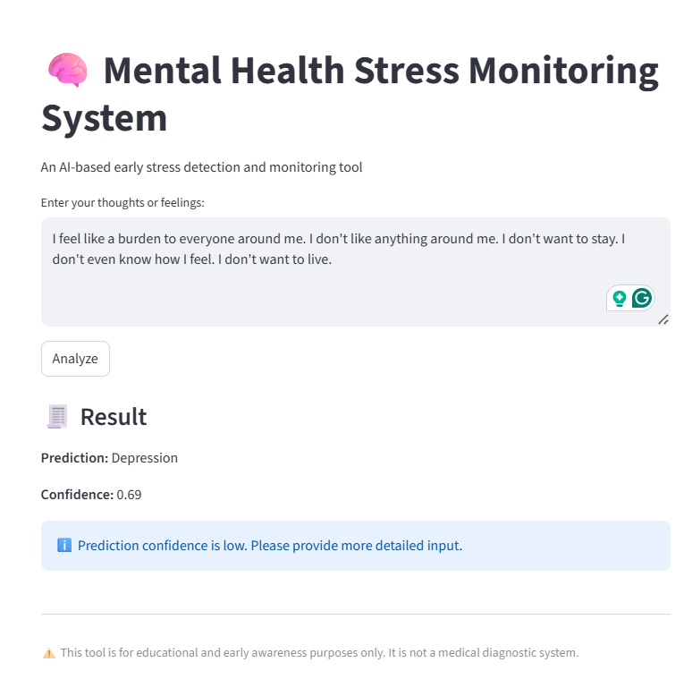

# AI-Based Mental Health Stress Monitoring System

An AI-powered mental health stress monitoring and early warning system developed using Natural Language Processing (NLP) and DistilBERT-based text classification.

## Overview

This project focuses on analyzing textual input to identify possible mental health conditions such as Anxiety, Depression, and Suicidal tendencies. The system is designed as an early awareness and monitoring tool rather than a medical diagnostic solution.

The application uses a fine-tuned DistilBERT transformer model along with confidence-based filtering and explainability mechanisms to provide responsible and interpretable predictions.

---

## Features

* NLP-based mental health text classification
* DistilBERT transformer model implementation
* Confidence-based filtering for ethical prediction handling
* Explainability module highlighting stress-related keywords
* Real-time prediction interface using Streamlit
* Multi-class classification:

  * Normal
  * Anxiety
  * Depression
  * Suicidal

---

## Tech Stack

* Python
* DistilBERT
* Hugging Face Transformers
* PyTorch
* Streamlit
* NLP Techniques

---

## System Architecture

The system follows the pipeline below:

1. User Input
2. Text Preprocessing and Tokenization
3. DistilBERT-based Classification
4. Confidence-Based Filtering
5. Explainability Module
6. Prediction and Confidence Display

---

## Results

* Achieved approximately 81% classification accuracy
* Implemented confidence filtering to reduce false-positive predictions
* Developed a real-time web-based prediction interface using Streamlit

---

## Project Structure

```text
mental-health-stress-monitoring-nlp/
│
├── src/
│   └── main.py
│
├── docs/
│   └── project-report.pdf
│
├── screenshots/
│   ├── streamlit-interface.png
│   ├── confusion-matrix.png
│   ├── precision-recall-f1score.png
│   └── system-architecture.png
│
└── README.md
```

---

## Screenshots

### Streamlit Interface



### System Architecture


### Confusion Matrix


---

## Future Enhancements

* Multilingual text analysis
* Mobile application deployment
* Larger and more diverse datasets
* Improved explainability techniques
* Voice-based stress analysis integration

---

## Disclaimer

This project is intended for educational and early awareness purposes only and should not be considered a medical diagnostic system.

---

## Author

Aayushi
B.Tech CSE, KIIT University
